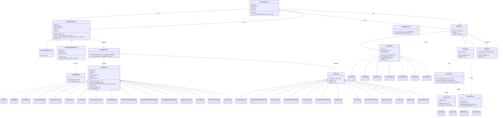

# Class Diagram (LLD)

```mermaid
%% GenXData - Core Classes and Relationships (Mermaid)
%% Class diagram of main modules: core, strategies, writers, messaging

classDiagram
  %% Orchestrator and Processors
  class DataOrchestrator {
    - config: dict
    - perf_report: bool
    - stream: any
    - batch: any
    + run() dict
    + _create_writer(config, stream_config) BaseWriter
  }

  class BaseConfigProcessor {
    - config: dict
    - writer: BaseWriter
    - column_names: list
    - rows: int
    - configs: list
    + validate_config() bool
    + create_base_dataframe(size) DataFrame
    + process_column_strategies(df, strategy_state, mode) DataFrame
    + process() dict
  }
  class NormalConfigProcessor {
    + process() dict
  }
  class StreamingConfigProcessor {
    - batch_size: int
    - chunk_size: int
    - strategy_state: dict
    + process() dict
    + _process_chunk(chunk_size) DataFrame
  }

  DataOrchestrator --> BaseConfigProcessor : uses
  BaseConfigProcessor <|-- NormalConfigProcessor
  BaseConfigProcessor <|-- StreamingConfigProcessor
  DataOrchestrator --> BaseWriter : creates

  %% Strategy Factory and Mapping
  class StrategyFactory {
    + create_strategy(mode, name, **kwargs) BaseStrategy
    + execute_strategy(strategy, mode) (DataFrame, dict)
  }
  class StrategyMapping {
    + get_strategy_class(name)
    + get_config_class(name)
  }

  BaseConfigProcessor --> StrategyFactory : composes
  StrategyFactory ..> StrategyMapping : resolves
  StrategyFactory --> BaseStrategy : creates
  StrategyFactory --> BaseConfig : validates

  %% Base Strategy and Mixins
  class BaseStrategy {
    - df: DataFrame
    - col_name: str
    - rows: int
    - is_intermediate: bool
    - params: dict
    - strategy_state: dict
    + generate_data(count) Series
    + generate_chunk(count) Series
    + apply_to_dataframe(df, column_name, mask) DataFrame
    + reset_state()
    + get_current_state() dict
    + sync_state(result) dict
  }
  class SeedMixin
  class StatefulMixin
  class ValidationMixin

  %% Representative Strategies
  class NumberRangeStrategy
  class DateGeneratorStrategy
  class PatternStrategy
  class SeriesStrategy
  class DistributedChoiceStrategy
  class TimeRangeStrategy
  class DistributedTimeRangeStrategy
  class DistributedNumberRangeStrategy
  class DistributedDateRangeStrategy
  class ReplacementStrategy
  class ConcatStrategy
  class RandomNameStrategy
  class DeleteStrategy

  BaseStrategy <|-- NumberRangeStrategy
  BaseStrategy <|-- DateGeneratorStrategy
  BaseStrategy <|-- PatternStrategy
  BaseStrategy <|-- SeriesStrategy
  BaseStrategy <|-- DistributedChoiceStrategy
  BaseStrategy <|-- TimeRangeStrategy
  BaseStrategy <|-- DistributedTimeRangeStrategy
  BaseStrategy <|-- DistributedNumberRangeStrategy
  BaseStrategy <|-- DistributedDateRangeStrategy
  BaseStrategy <|-- ReplacementStrategy
  BaseStrategy <|-- ConcatStrategy
  BaseStrategy <|-- RandomNameStrategy
  BaseStrategy <|-- DeleteStrategy

  %% Configs for Strategies
  class BaseConfig {
    + from_dict(d) BaseConfig
    + to_dict() dict
    + validate() void
  }
  class NumberRangeConfig
  class DistributedNumberRangeConfig
  class DateRangeConfig
  class DistributedDateRangeConfig
  class TimeRangeConfig
  class DistributedTimeRangeConfig
  class PatternConfig
  class SeriesConfig
  class DistributedChoiceConfig
  class ReplacementConfig
  class ConcatConfig
  class DeleteConfig
  class RandomNameConfig

  BaseConfig <|-- NumberRangeConfig
  BaseConfig <|-- DistributedNumberRangeConfig
  BaseConfig <|-- DateRangeConfig
  BaseConfig <|-- DistributedDateRangeConfig
  BaseConfig <|-- TimeRangeConfig
  BaseConfig <|-- DistributedTimeRangeConfig
  BaseConfig <|-- PatternConfig
  BaseConfig <|-- SeriesConfig
  BaseConfig <|-- DistributedChoiceConfig
  BaseConfig <|-- ReplacementConfig
  BaseConfig <|-- ConcatConfig
  BaseConfig <|-- DeleteConfig
  BaseConfig <|-- RandomNameConfig

  %% Writers
  class BaseWriter {
    + write(df, metadata) dict
    + finalize() dict
    + validate_config() bool
  }
  class BaseFileWriter {
    - params: dict
    - base_output_path: str
    - output_path: str
    + get_expected_extensions() list
    + get_default_params() dict
    + write(df, metadata) dict
    + finalize() dict
  }
  class CsvFileWriter
  class JsonFileWriter
  class ExcelFileWriter
  class ParquetFileWriter
  class FeatherFileWriter
  class HtmlFileWriter
  class SqliteFileWriter
  class FileWriterFactory {
    + create_writer(type, params) BaseFileWriter
    + create_multiple_writers(configs) list
  }
  class StreamWriter {
    - queue_producer
    + write(df, metadata) dict
    + finalize() dict
  }
  class BatchWriter {
    - writer_implementation: BaseWriter
    + write(df, metadata) dict
    + finalize() dict
  }

  BaseWriter <|-- BaseFileWriter
  BaseWriter <|-- StreamWriter
  BaseWriter <|-- BatchWriter
  BaseFileWriter <|-- CsvFileWriter
  BaseFileWriter <|-- JsonFileWriter
  BaseFileWriter <|-- ExcelFileWriter
  BaseFileWriter <|-- ParquetFileWriter
  BaseFileWriter <|-- FeatherFileWriter
  BaseFileWriter <|-- HtmlFileWriter
  BaseFileWriter <|-- SqliteFileWriter
  FileWriterFactory ..> BaseFileWriter : creates
  BatchWriter o--> BaseWriter : delegates

  %% Messaging
  class QueueConfig {
    + validate_config() void
    + queue_type str
    + get_producer_config() dict
  }
  class AMQPConfig
  class KafkaConfig
  class QueueProducer {
    + connect() void
    + disconnect() void
    + send_dataframe(df, batch_info) void
    + send_message(message) void
  }
  class AMQPProducer
  class KafkaProducer
  class QueueFactory {
    + create_config(type, data) QueueConfig
    + create_producer(config) QueueProducer
    + create_from_config(stream_config) QueueProducer
  }

  QueueConfig <|-- AMQPConfig
  QueueConfig <|-- KafkaConfig
  QueueProducer <|-- AMQPProducer
  QueueProducer <|-- KafkaProducer
  QueueFactory ..> QueueConfig : creates
  QueueFactory ..> QueueProducer : creates
  StreamWriter ..> QueueFactory : uses
  StreamWriter ..> QueueProducer : sends

  %% Associations
  DataOrchestrator o--> BaseWriter : owns
  DataOrchestrator o--> BaseConfigProcessor : owns
  BaseStrategy ..> SeedMixin
  BaseStrategy ..> StatefulMixin
  BaseStrategy ..> ValidationMixin
```
